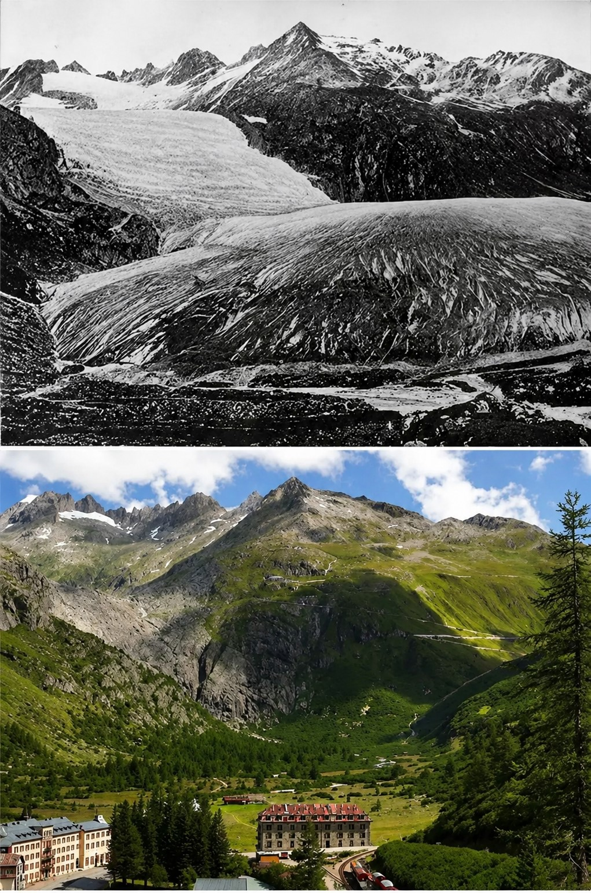
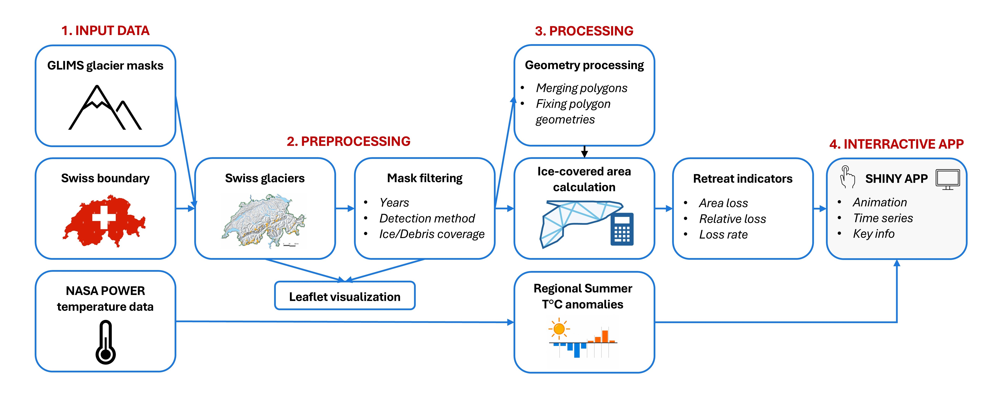

<h1 style="text-align:center;">

Retreat of Swiss glaciers

</h1>

## Context of the project

Mountain glaciers are among the clearest indicators of climate change in Earth’s history. Their surface area and volume are directly linked to changes in meteorological conditions, especially temperature and precipitation. In the Alps, glacier retreat is therefore not only a visible marker of environmental change, but also a process with important consequences for freshwater resources, natural hazards, ecosystems and alpine landscapes (IPCC, 2019).

Alpine glaciers have been retreating since the end of the Little Ice Age (\~1850), and this retreat has accelerated over recent decades (Sommer et al., 2020). Switzerland is particularly concerned by this process with almost 100% of its glaciers that are currently retreating (Linsbauer et al., 2021). With rising temperatures and the increasing frequency of summer heat waves, it is therefore necessary to better understand how glaciers respond to these rapid changes (Cremona et al., 2023).

{#fig-rhonegletscher width="100%"}

In this context, repeated glacier inventories are essential for documenting glacier changes through time. In Switzerland, GLAMOS observes and documents long-term glacier changes in the Swiss Alps, including changes in glacier area, volume, snow accumulation, ice melt, glacier flow and ice temperature. These data are also made accessible through Swiss geodata infrastructures, highlighting the importance of spatial data for monitoring glacier retreat and communicating it to decision-makers and the general public (Swiss Federal Office of Topography swisstopo, 2021; GLAMOS, 2026).

## Objectives

The objective of this project is to develop a reproducible geospatial workflow in R to process Swiss glacier masks, quantify glacier surface loss over time, and visualise glacier retreat interactively. The analysis is based on a filtered Swiss Alpine subset of the GLIMS world glacier database, developed by the NASA. The final output is a Shiny app that allows users to select a single glacier, explore its extent over time, and compare its area evolution with a regional summer temperature anomaly indicator. Then, a secondary objective is to make the workflow extensible by allowing a "user-added glacier" mask to be integrated into the existing database. The project therefore combines spatial data processing, temporal analysis and interactive visualisation in order to make glacier retreat easier to analyse and communicate.

## Data and methodology

This project mainly relies on glacier outline data from the GLIMS Glacier Database and climate data from NASA POWER. In addition, the national boundary of Switzerland from the GADM database is used as a spatial layer to restrict the analysis to Swiss glaciers.

First, the glacier dataset is based on a pre-filtered Alpine subset of the GLIMS Glacier Database, which provides glacier masks for multiple observation dates. These masks include glacier boundary polygons and, for some of the most recent years, debris-cover polygons. The original GLIMS data are distributed by NASA/NSIDC (Raup et al., 2007), but a pre-filtered subset is used here to simplify data access, decrease the downloading time and avoid authentication barriers during the execution of the workflow. The Swiss national boundary, obtained from the GADM database, is then used to filter the swiss glaciers. All spatial layers are transformed to EPSG:2056, corresponding to the Swiss projected coordinate reference system CH1903+ / LV95. This projection is used for spatial processing and area calculation because it is appropriate for Switzerland. In the visualisation, however, the data are displayed in WGS84, as the *leaflet* package only supports this CRS.\
\
Then, a regional climate indicator is extracted from NASA POWER (NASA Langley Research Center, 2025). Monthly mean near-surface air temperature is downloaded for a representative point located near the Rhone Glacier in the central Swiss Alps. This point is not interpreted as a local measurement for each glacier, but rather as a regional indicator of summer temperature variability in the Swiss Alpine context. The temperatures are extracted from this point for the period 1981 to 2024 and are used to compute a summer temperature indicator. For each year, the mean temperature of June, July and August is calculated. Temperature anomalies are then derived relative to the 1981–2010 reference period. These anomalies are not used as a predictive model of glacier retreat, but as a contextual variable that helps compare glacier area evolution with regional summer temperature variability.

Finally, an optional module was realised to allow the integration of a user-provided glacier mask. The user must specify the path to the shapefile, the name of the corresponding glacier in the GLIMS database, the year of the new mask, and, if available, the column distinguishing ice cover from debris cover. The module checks that the shapefile exists, verifies its coordinate reference system, reprojects it to the same CRS as the GLIMS data, and standardises its attributes so that it can be added to the existing database.

## Conceptual workflow

The conceptual workflow of the project is summarised in the figure below. It shows the main steps of the analysis, from input data to the final Shiny application.

{width="100%"}

## Shiny app and Github

The shiny app is available on : <https://mdaman.shinyapps.io/swiss-glacier-retreat/>

All the codes are available on : <https://github.com/mdaman-ucl/swiss-glacier-retreat>

## Workflow

### Preliminary set up

This first section prepares the working environment. The project is run from its root directory using the \`here\` package, which avoids relying on absolute paths specific to one computer. This makes the Quarto document easier to share and rerun on another machine, as long as it is opened from the associated RStudio project file.

*First, set the project*

```{r}
here::here()
```

*Packages installation*

```{r}

if (!require("pacman")) {
  install.packages("pacman", repos = "https://cloud.r-project.org")
}

pacman::p_load(tidyverse, shiny, sf, terra, leaflet, tmap, mapview, geodata, here, rgbif, stars, rmapshaper, later, googledrive, nasapower, htmltools,bslib)
```

*The following paths define the main project folders. They are used throughout the workflow to keep raw data, processed data, figures and scripts separated.*

```{r}

# Main project paths
raw_dir <- here::here("data", "raw")
glims_dir <- here::here("data", "raw", "glims_alps")
user_glacier_dir <- here::here("data", "raw", "user_glacier")
processed_dir <- here::here("data", "processed")
figures_dir <- here::here("outputs", "figures")
r_dir <- here::here("R")
```

```{r}
#| results: hide

# Create project folders
dirs <- c(raw_dir, glims_dir, user_glacier_dir, processed_dir, figures_dir, r_dir)

lapply(dirs, dir.create, showWarnings = FALSE, recursive = TRUE)
```

### Data loading and visualization

The original GLIMS data are provided by NASA/NSIDC. However, in this project, a pre-filtered Alpine subset is used to avoid the heavier processing steps required to extract the study area from the full database. This subset is stored in a publicly shared personal Google Drive folder and is downloaded directly from there.

Before downloading the files, the user may be asked to authenticate with a Google account. In this case, the access request must be accepted by **ticking the Google Drive permission box** and clicking “Continue”. This authentication step only allows R to access and download the files from the shared folder. The shapefiles are then imported into the local project folders, and the download is only performed if the files are not already present locally.

```{r}

# Download GLIMS Alpine subset and user shapefile only if they are not already present locally
if (
  !file.exists(file.path(glims_dir, "glims_polygons.shp")) ||
  !file.exists(file.path(user_glacier_dir, "festigletscher_2023.shp"))
) {

  # Disconnect any existing Google Drive session and re-authenticate in read-only mode
  googledrive::drive_deauth()
  googledrive::drive_auth(
    email = TRUE,
    scopes = "https://www.googleapis.com/auth/drive.readonly",
    cache = FALSE)

  # Google Drive folder ID
  folder_id <- "1lzOkeDUi6IRk3fIBYufcw9qzWLdnqxsC"

  # List files available in the Google Drive folder
  drive_files <- googledrive::drive_ls(googledrive::as_id(folder_id))

  # Download all files into the GLIMS raw folder
  purrr::walk2(
    drive_files$id,
    drive_files$name,
    ~ googledrive::drive_download(
      file = googledrive::as_id(.x),
      path = file.path(glims_dir, .y),
      overwrite = TRUE))

  # Copy the downloaded user shapefile components into the dedicated user_glacier folder
  user_shape_files <- list.files(
    glims_dir,
    pattern = "^festigletscher_2023\\.",
    full.names = TRUE)

  if (length(user_shape_files) > 0) {
    file.copy(
      from = user_shape_files,
      to = file.path(user_glacier_dir, basename(user_shape_files)),
      overwrite = TRUE)
  }
}
```

*Import the GLIMS glacier polygons and transform them to the Swiss CRS (EPSG:2056 - CH1903+/LV95).*

```{r}

# Read GLIMS glacier polygons + fix invalid geometries 
glaciers <- sf::st_read(
  file.path(glims_dir, "glims_polygons.shp"),
  quiet = TRUE
) |>
  sf::st_make_valid() |>
  sf::st_transform(2056)
```

*Import the Swiss boundary and transform it to the same CRS*

```{r}

swiss <- geodata::gadm(country = "CHE", level = 0, path = raw_dir) |>
  sf::st_as_sf() |> 
  sf::st_transform(2056)
```

*The glacier dataset is intersected with the Swiss boundary to retain only Swiss glaciers. A year variable is also extracted from the GLIMS source date, which is required for temporal filtering, plotting and animation in the Shiny application.*

```{r}

sf::sf_use_s2(FALSE) # disable strict spherical geometry

glaciers_switzerland <- glaciers[st_intersects(glaciers, swiss, sparse = FALSE), ] |>
  dplyr::mutate(
    src_date_chr = as.character(src_date),
    year = suppressWarnings(as.integer(substr(src_date_chr, 1, 4))))
```

*Define map colours used in the leaflet visualisations and a north arrow*

```{r}
map_ice <- "#7DD3FC"
map_outline <- "#2A9FD6"
map_debris <- "#8B6F47"
map_debris_outline <- "#5C4630"
map_selected <- "#F97316"

north_arrow <- htmltools::HTML(
  "<div style='background: rgba(255,255,255,0.85);
               padding: 6px 8px;
               border-radius: 5px;
               text-align:center;
               font-weight:bold;
               color:#0B253A;
               box-shadow: 0 1px 4px rgba(0,0,0,0.25);'>
     N<br>↑
   </div>")
```

*Initial visual check on four large Swiss glaciers.*

```{r}

selected_glaciers <- c("Grosser Aletschgletscher", "Rhonegletscher", "Fieschergletscher E","Hüfifirn")

# Create a subset for selected glaciers and arrange the masks by date
glaciers_subset <- glaciers_switzerland |>
  dplyr::filter(glac_name %in% selected_glaciers) |>
  dplyr::arrange(src_date)

# Transform to WGS84 for leaflet visualization
glaciers_subset_leaflet <- sf::st_transform(glaciers_subset, 4326)

leaflet::leaflet(glaciers_subset_leaflet) |>
  leaflet::addProviderTiles(leaflet::providers$Esri.WorldImagery) |>
  leaflet::addPolygons(
    fillColor = map_ice,
    fillOpacity = 0.25,
    color = map_outline,
    weight = 0.7,
    popup = ~paste0(
      "<b>", glac_name, "</b>",
      "<br>Date: ", src_date,
      "<br>Type: ", line_type
    )
  ) |>
  leaflet::addScaleBar(position = "bottomleft") |>
  leaflet::addLegend(
    position = "bottomright",
    colors = map_ice,
    labels = "Glacier masks",
    title = "Layer"
  ) |>
  leaflet::addControl(
    html = north_arrow,
    position = "topright"
  )
```

### Years filters and column selections

The GLIMS database contains glacier outlines from different years, sources, analysts and mapping methods. Therefore, a filtering step was applied to keep only the observations that were sufficiently consistent for analysing glacier retreat through time.

The selection was based on the coherence of the mapped glacier outlines, after exploring the dataset visually, notably in ArcGIS. Dates with very coarse resolution, poorly digitised polygons or inconsistent geometries were removed. Some older masks were also excluded when they appeared unrealistically large, for example when they seemed to include debris-covered areas without identifying them as such. This was done to avoid artificial area changes caused by mapping inconsistencies rather than by real glacier retreat. After this filtering, unnamed glaciers were removed, and only the columns required for the following processing steps were kept.

```{r}

glaciers_filtered <- glaciers_switzerland |>
  
  # Remove unnamed glaciers
  dplyr::filter(!is.na(glac_name), glac_name != "None") |>
  
  # Keep only the selected inventory years
  dplyr::filter(
    (!is.na(year)& dplyr::between(year, 1850, 1947)) |
      startsWith(src_date_chr, "1969") |
      startsWith(src_date_chr, "1973") |
      startsWith(src_date_chr, "1998") |
      (startsWith(src_date_chr, "1999") & analysts == "Paul, Frank") |
      (src_date_chr %in% c("2003-08-06T00:00:00", "2003-08-13T00:00:00") &
         analysts == "Frey, Holger; Le Bris, Raymond; Paul, Frank; Rastner, Philipp") |
      (dplyr::between(year, 2013, 2018) &
         chief_affl == "GLAMOS (Glacier Monitoring Switzerland)") |
      startsWith(src_date_chr, "2009")
  ) |>
  
  # Keep only the columns needed for the next steps
  dplyr::select(line_type, glac_name, mean_elev, max_elev, src_date, src_date_chr, year,
    chief_affl, anlys_id, glac_id, parent_id, analysts, geometry) |>
  
  # Fix invalid geometries before spatial processing
  sf::st_make_valid()
```

*Visual check after temporal and attribute filtering.*

```{r}

glaciers_subset_filtered <- glaciers_filtered |>
  dplyr::filter(glac_name %in% selected_glaciers) |>
  dplyr::arrange(glac_name, src_date)

# again changing CRS for leaflet 
glaciers_subset_filtered_leaflet <- sf::st_transform(glaciers_subset_filtered, 4326)

leaflet::leaflet(glaciers_subset_filtered_leaflet) |>
  leaflet::addProviderTiles(leaflet::providers$Esri.WorldImagery) |>
  leaflet::addPolygons(
    fillColor = ~dplyr::case_when(
      line_type == "debris_cov" ~ map_debris,
      TRUE ~ map_ice
    ),
    fillOpacity = 0.35,
    color = ~dplyr::case_when(
      line_type == "debris_cov" ~ map_debris_outline,
      TRUE ~ map_outline
    ),
    weight = 0.8,
    # define the content of the popup when we click on a mask
    # we select the glaciers names and the date of the mask
    popup = ~paste0(
      "<b>", glac_name, "</b>",
      "<br>Date: ", src_date,
      "<br>Year: ", year,
      "<br>Type: ", line_type
    )
  ) |>
  leaflet::addScaleBar(position = "bottomleft") |>
  leaflet::addLegend(
    position = "bottomright",
    colors = c(map_ice, map_debris),
    labels = c("Ice / glacier boundary", "Debris cover"),
    title = "Layer"
  ) |>
  leaflet::addControl(
    html = north_arrow,
    position = "topright"
  )
```

<br>

*The following table summarises the number of retained observations and the temporal extent available for each glacier. It is mainly used as a diagnostic object to inspect the final temporal coverage of the filtered dataset.*

```{r}
glacier_catalog <- glaciers_filtered |>
  sf::st_drop_geometry() |>
  dplyr::group_by(glac_id, glac_name) |>
  dplyr::summarise(
    n_obs = dplyr::n(),
    year_min = min(year, na.rm = TRUE),
    year_max = max(year, na.rm = TRUE),
    .groups = "drop") |>
  dplyr::arrange(dplyr::desc(n_obs), glac_name)

# Display the 10 glaciers with the highest number of observations
glacier_catalog |>
  dplyr::slice_head(n = 10)
```

### Preprocessing

This step prepares the filtered glacier masks for quantitative analysis and interactive visualization. It is applied to all selected Swiss glaciers rather than to a few examples only. First, only glaciers with at least three distinct observation dates are retained, in order to ensure a meaningful temporal evolution. The workflow then keeps only the 2 features needed for the analysis: glacier boundaries and debris-covered areas. These geometries are merged by glacier, date and feature type before computing net ice-cover area.

*Keep only glaciers with at least 3 distinct observation dates*

```{r}

glaciers_keep <- glaciers_filtered |>
  sf::st_drop_geometry() |>
  dplyr::distinct(glac_id, glac_name, src_date) |>
  dplyr::count(glac_id, glac_name, name = "n_dates") |>
  dplyr::filter(n_dates >= 3)

glaciers_filtered_3dates <- glaciers_filtered |>
  dplyr::semi_join(glaciers_keep, by = c("glac_id", "glac_name"))
```

*Keep only glacier outlines and debris-covered areas*

```{r}

glacier_base <- glaciers_filtered_3dates |>
  dplyr::filter(line_type %in% c("glac_bound", "debris_cov")) |>
  sf::st_make_valid()
```

*Merge geometries for the same glacier_id, date and feature type*

```{r}

glacier_merged <- glacier_base |>
  dplyr::group_by(glac_id, glac_name, src_date, year, line_type) |>
  dplyr::summarise(
    geometry = sf::st_union(geometry),
    .groups = "drop")
```

*Split the dataset in "ice" glacier boundaries and debris-covered areas*

```{r}

glac_bound_merged <- glacier_merged |>
  dplyr::filter(line_type == "glac_bound")

debris_merged <- glacier_merged |>
  dplyr::filter(line_type == "debris_cov")
```

*The following step computes the net glacier area. Each glacier-date combination is processed independently. When a matching debris-cover polygon exists, it is removed from the glacier boundary using \`st_difference()\`. If no debris polygon is available for that date, the full glacier boundary is kept. The resulting geometry is then used to calculate the net ice-cover area.*

```{r}

glac_bound_area <- glac_bound_merged |>
  
  # Process each glacier-date combination independently
  dplyr::group_by(glac_id, glac_name, src_date, year) |>
  
  dplyr::group_modify(~{
    
    # Extract glacier boundary geometry
    bound_geom <- sf::st_geometry(.x)[[1]]
    
    # Find matching debris polygon (same glacier + date)
    debris_match <- debris_merged |>
      dplyr::filter(
        glac_id   == .y$glac_id,
        glac_name == .y$glac_name,
        src_date  == .y$src_date
      )
    
    # Remove debris area if it exists
    geom_final <- if (nrow(debris_match) == 0) {
      bound_geom
    } else {
      debris_geom <- sf::st_geometry(debris_match)[[1]]
      sf::st_difference(bound_geom, debris_geom)
    }
    
    # Return only new variables (grouping columns are added automatically)
    sf::st_sf(
      line_type = "glac_bound",
      area_m2   = as.numeric(sf::st_area(geom_final)),
      geometry  = sf::st_sfc(geom_final, crs = sf::st_crs(.x))
    )
    
  }) |>
  
  # Remove grouping structure
  dplyr::ungroup()
```

*Debris-covered areas are also kept separately for mapping purposes in the Shiny application.*

```{r}

debris_area <- debris_merged |>
  dplyr::mutate(
    area_m2 = as.numeric(sf::st_area(geometry)))
```

*Combine net glacier outlines and debris cover into one single spatial object*

```{r}

glacier_map_data <- dplyr::bind_rows(glac_bound_area,debris_area) |>
  sf::st_as_sf()
```

*Some of the glaciers share the same name but different IDs, so we merge glacier parts that share the same name, date and line type.*

```{r}
glacier_map_data <- glacier_map_data |>
  sf::st_make_valid() |>
  dplyr::mutate(src_date_chr = as.character(src_date)) |>
  dplyr::group_by(glac_name, year, line_type) |>
  dplyr::summarise(
    glac_id = paste(sort(unique(glac_id)), collapse = "; "),
    src_date = paste(sort(unique(src_date_chr)), collapse = "; "),
    geometry = sf::st_union(geometry),
    .groups = "drop"
  ) |>
  sf::st_make_valid() |>
  dplyr::mutate(
    area_m2 = as.numeric(sf::st_area(geometry))
  )
```

*Build a non-spatial table for time-series plots and area-loss indicators. Keeping glac_bound because area_m2 already corresponds to the area excluding debris.*

```{r}

glacier_plot_data <- glacier_map_data |>
  dplyr::filter(line_type == "glac_bound") |>
  sf::st_drop_geometry() |>
  dplyr::select(glac_name, src_date, year, area_m2) |>
  dplyr::group_by(glac_name) |>
  dplyr::arrange(year, .by_group = TRUE) |>
  dplyr::mutate(
    area_first_m2 = dplyr::first(area_m2),
    year_first = dplyr::first(year),
    area_last_m2 = dplyr::last(area_m2),
    year_last = dplyr::last(year),
    area_loss_m2 = area_first_m2 - area_m2,
    area_loss_pct = 100 * (area_first_m2 - area_m2) / area_first_m2
  ) |>
  dplyr::ungroup()
```

*Express area loss using the equivalent number of football fields (105 × 68 m)*

```{r}

football_field_m2 <- 105 * 68   # 7140 m² to define the area of a "standard" field

glacier_plot_data <- glacier_plot_data |>
  dplyr::mutate(area_loss_football_fields = area_loss_m2 / football_field_m2)
```

*The summary table stores one line per glacier, with the first and last available observation years, total ice-cover loss, relative loss and mean annual loss rate.*

```{r}

glacier_summary_data <- glacier_plot_data |>
  dplyr::group_by(glac_name) |>
  dplyr::summarise(
    year_first = min(year, na.rm = TRUE),
    year_last = max(year, na.rm = TRUE),
    area_first_m2 = area_m2[which.min(year)],
    area_last_m2 = area_m2[which.max(year)],
    area_loss_total_m2 = area_first_m2 - area_last_m2,
    area_loss_total_pct = 100 * (area_first_m2 - area_last_m2) / area_first_m2,
    date_span_years = year_last - year_first,
    .groups = "drop"
  ) |>
  dplyr::mutate(
    area_loss_total_football_fields = area_loss_total_m2 / football_field_m2,
    area_loss_rate_km2_per_year = (area_loss_total_m2 / 1e6) / date_span_years,
    area_loss_rate_pct_per_year = area_loss_total_pct / date_span_years
  ) |>
  dplyr::arrange(dplyr::desc(area_loss_total_m2))

# Display the 10 glaciers with the highest total ice-cover loss
glacier_summary_data |>
  dplyr::slice_head(n = 10)
```

*Quick visualisation of ice-cover area loss through time for a selected glacier, using the Rhonegletscher as an example.*

```{r}

plot_glacier_name <- "Rhonegletscher"

ggplot(
  glacier_plot_data |> dplyr::filter(glac_name == plot_glacier_name),
  aes(x = year, y = area_m2 / 1e6)
) +
  geom_line(color = "#2C7FB8") +
  geom_point(color = "#2C7FB8") +
  labs(
    title = paste("Ice-cover area evolution of", plot_glacier_name),
    x = "Year",
    y = "Ice-cover area (km²)"
  ) +
  theme_minimal()

```

```{r}
### Overview of the area

# Identify the latest available year for each glacier
latest_glacier_dates <- glaciers_filtered_3dates |>
  sf::st_drop_geometry() |>
  dplyr::filter(line_type == "glac_bound") |>
  dplyr::group_by(glac_id, glac_name) |>
  dplyr::summarise(
    latest_year = max(year, na.rm = TRUE),
    .groups = "drop"
  )

# Keep only the latest glacier mask for each glacier
latest_glaciers <- glaciers_filtered_3dates |>
  dplyr::filter(line_type == "glac_bound") |>
  dplyr::inner_join(
    latest_glacier_dates,
    by = c("glac_id", "glac_name")
  ) |>
  dplyr::filter(year == latest_year) |>
  dplyr::select(-latest_year)
```

```{r}
# Transform to WGS84 for leaflet
latest_glaciers_leaflet <- latest_glaciers |>
  sf::st_transform(4326)

leaflet::leaflet(latest_glaciers_leaflet) |>
  leaflet::addProviderTiles(leaflet::providers$Esri.WorldImagery) |>
  leaflet::addPolygons(
    fillColor = map_ice,
    fillOpacity = 0.35,
    color = map_outline,
    weight = 0.45,
    popup = ~paste0(
      "<b>", glac_name, "</b>",
      "<br>Latest mask date: ", src_date,
      "<br>Year: ", year
    ),
    label = ~glac_name,
    highlightOptions = leaflet::highlightOptions(
      weight = 2,
      color = map_selected,
      fillOpacity = 0.55,
      bringToFront = TRUE
    )
  ) |>
  leaflet::addScaleBar(position = "bottomleft") |>
  leaflet::addLegend(
    position = "bottomright",
    colors = map_ice,
    labels = "Latest available glacier mask",
    title = "Layer"
  ) |>
  leaflet::addControl(
    html = north_arrow,
    position = "topright"
  )
```

<br>

*Prepare valid glacier geometries*

```{r}
 
glacier_map_data_proj <- glacier_map_data |>
  sf::st_make_valid()
```

```{r}

# Simple diagnostic statistics for the retained glacier dataset
dataset_overview <- glacier_summary_data |>
  dplyr::mutate(
    date_span_years = year_last - year_first,
    area_first_km2 = area_first_m2 / 1e6,
    area_last_km2 = area_last_m2 / 1e6,
    area_loss_total_km2 = area_loss_total_m2 / 1e6
  ) |>
  dplyr::summarise(
    n_glaciers = dplyr::n(),
    first_inventory_year = min(year_first, na.rm = TRUE),
    last_inventory_year = max(year_last, na.rm = TRUE),
    median_time_span_years = median(date_span_years, na.rm = TRUE),
    total_initial_area_km2 = sum(area_first_km2, na.rm = TRUE),
    total_final_area_km2 = sum(area_last_km2, na.rm = TRUE),
    total_area_loss_km2 = sum(area_loss_total_km2, na.rm = TRUE),
    total_area_loss_pct = 100 * total_area_loss_km2 / total_initial_area_km2,
    median_relative_loss_pct = median(area_loss_total_pct, na.rm = TRUE)
  )

# Show the results as a table
dataset_overview |>
  tidyr::pivot_longer(
    cols = dplyr::everything(),
    names_to = "Indicator",
    values_to = "Value"
  ) |>
  dplyr::mutate(
    Indicator = dplyr::recode(
      Indicator,
      n_glaciers = "Number of glaciers",
      first_inventory_year = "Earliest first inventory year",
      last_inventory_year = "Latest last inventory year",
      median_time_span_years = "Median observation period (years)",
      total_initial_area_km2 = "Total initial ice-cover area (km²)",
      total_final_area_km2 = "Total final ice-cover area (km²)",
      total_area_loss_km2 = "Total ice-cover loss (km²)",
      total_area_loss_pct = "Total relative ice-cover loss (%)",
      median_relative_loss_pct = "Median glacier-level relative loss (%)"
    ),
    Value = round(as.numeric(Value), 2)
  ) |>
  knitr::kable()
```

### Optional user-added glacier mask shapefile

An optional module was added to make the workflow extensible. It allows a user-provided glacier mask shapefile to be integrated into the existing GLIMS-based dataset. In this project, the module is tested with a manually digitised 2023 mask of the Festigletscher, based on an orthophoto.

The user must provide the path to the shapefile, the glacier name as it appears in the GLIMS database, the observation year, and, if available, the name of the column distinguishing ice cover from debris cover. The shapefile is located in the data/raw folder and must also include its spatial reference information, usually stored in the associated .prj file.

*Define the optional user shapefile module by setting whether it should be activated, where the shapefile is located, which glacier and year it represents, and which attribute column identifies ice cover and debris cover.*

```{r}

# Set on FALSE if you want to switch off the module
add_user_shapefile <- TRUE

# Path of the shapefile to add
user_shp <- file.path(user_glacier_dir, "festigletscher_2023.shp")

user_glacier_name <- "Festigletscher"
user_glacier_year <- 2023

# Column used to distinguish ice cover and debris cover.
# If there is no such column, set this to NA. In my case the column name is "type"
user_type_col <- "type"
```

*Read and prepare the added shapefile.*

```{r}

# Code read only if the shapefile exists and the module is turned on
if (add_user_shapefile && file.exists(user_shp)) {

  # read the shapefile and correct potential invalid geometries
  user_shape_raw <- sf::st_read(user_shp, quiet = TRUE) |>
    sf::st_make_valid()
  
  # check if the shapefile has a CRS file associated
  if (is.na(sf::st_crs(user_shape_raw))) {
    stop("The user shapefile has no CRS. Please provide the associated .prj file.")}

  # # Reproject the user shapefile to the same CRS as the GLIMS data
  user_shape_raw <- user_shape_raw |>
    sf::st_transform(sf::st_crs(glacier_map_data_proj))
}
```

*User-defined glacier name is matched to its GLIMS identifier so the new mask is linked to the correct glacier. If no match is found, the workflow stops.*

```{r}

if (add_user_shapefile && exists("user_shape_raw")) {

  # Use the existing GLIMS glacier ID for the selected glacier
  existing_id <- glacier_map_data_proj |>
    
    # Work only on the attribute table
    sf::st_drop_geometry() |>
    
    # Filter the glacier name provided by the user and retrieve its ID
    dplyr::filter(glac_name == user_glacier_name) |>
    dplyr::pull(glac_id) |>
    unique()

  # Make sure that the glacier already exists in the GLIMS database
  if (length(existing_id) == 0) {
    stop("No glacier with this name was found in the GLIMS database.")
  }
  
  # Assign the existing glacier ID to the added shapefile
  user_glacier_id <- existing_id[1]
}
```

*User-added shapefile attributes are standardised to match the workflow categories. If a "type" column exists, ice and debris values are converted to glac_bound and debris_cov. Otherwise, the shapefile is considered ice cover.*

```{r}

if (add_user_shapefile && exists("user_shape_raw") && exists("user_glacier_id")) {

  # Use the type column if it is available
  if (!is.na(user_type_col) && user_type_col %in% names(user_shape_raw)) {

    user_shape <- user_shape_raw |>
      dplyr::mutate(
        
        # Detect whether the user-defined type column contains ice or debris
        # and convert it to the same categories used in the GLIMS database
        type_clean = stringr::str_to_lower(as.character(.data[[user_type_col]])),
        line_type = dplyr::case_when(
          stringr::str_detect(type_clean, "ice") ~ "glac_bound",
          stringr::str_detect(type_clean, "debris") ~ "debris_cov",
          TRUE ~ NA_character_)) |>
      
      # Remove polygons whose type could not be identified
      dplyr::filter(!is.na(line_type)) |>
      
      # Remove the temporary cleaning column
      dplyr::select(-type_clean)

  } else {

    # If no type column is provided, the whole shapefile is considered as ice cover
    user_shape <- user_shape_raw |>
      dplyr::mutate(line_type = "glac_bound")
  }

  # Add the fields needed in the dataset and in the Shiny app
  user_shape <- user_shape |>
    dplyr::mutate(
      glac_id = user_glacier_id,
      glac_name = user_glacier_name,
      
      # Set the source date to January 1st of the user-defined year
      src_date = as.character(as.Date(paste0(user_glacier_year, "-01-01"))),
      year = as.integer(user_glacier_year),
      
      # Recalculate polygon area in square metres
      area_m2 = as.numeric(sf::st_area(geometry))) |>
    dplyr::select(glac_id, glac_name, src_date, year, line_type, area_m2, geometry)
}
```

*Standardised mask is added to the mapping dataset, and its ice-cover polygons are included in the time series and summary indicators.*

```{r}

if (add_user_shapefile && exists("user_shape")) {

  # Add the new mask to the spatial dataset used for mapping
  glacier_map_data_proj <- dplyr::bind_rows(glacier_map_data_proj, user_shape)

  # Keep only ice cover polygons for the area graph
  user_plot_data <- user_shape |>
    dplyr::filter(line_type == "glac_bound") |>
    sf::st_drop_geometry() |>
    dplyr::group_by(glac_id, glac_name, year) |>
    dplyr::summarise(
      area_m2 = sum(area_m2, na.rm = TRUE),
      .groups = "drop")

  # Add the new ice cover area to the plotting dataset
  glacier_plot_data <- dplyr::bind_rows(glacier_plot_data, user_plot_data)

  message("User shapefile added successfully: ", user_glacier_name, " - ", user_glacier_year)
}
```

*The summary indicators are recalculated after the module has been applied.*

```{r}
glacier_summary_data <- glacier_plot_data |>
  dplyr::group_by(glac_id, glac_name) |>
  dplyr::summarise(
    year_first = min(year, na.rm = TRUE),
    year_last = max(year, na.rm = TRUE),
    area_first_m2 = area_m2[which.min(year)],
    area_last_m2 = area_m2[which.max(year)],
    area_loss_total_m2 = area_first_m2 - area_last_m2,
    area_loss_total_pct = 100 * area_loss_total_m2 / area_first_m2,
    .groups = "drop"
  ) |>
  dplyr::mutate(
    area_loss_total_football_fields = area_loss_total_m2 / football_field_m2
  )
```

### Temperature anomalies

This section adds a climatic context to the glacier retreat analysis using NASA POWER data. NASA POWER was selected because it can be accessed directly from R through the *nasapower* package, making the workflow reproducible.

Monthly mean near-surface (2m) air temperature is extracted for a representative point located near the Rhone Glacier in the central Swiss Alps. Because NASA POWER is a gridded climate product with a relatively low spatial resolution (≃ 50km), this point is not interpreted as a local measurement for a specific glacier. It is used instead as a regional summer temperature indicator for the Swiss Alpine context.

\
For each year between 1981 and 2024, the mean summer temperature is calculated from June, July and August. Temperature anomalies are then computed by subtracting the 1981–2010 mean summer temperature from each annual JJA mean temperature. These anomalies are not used as a predictive model, but as a contextual variable to compare glacier area evolution with the approximate regional summer temperature variability.

```{r}

# creating the file path
temperature_file <- file.path(processed_dir, "regional_temperature_anomaly.csv")

if (!file.exists(temperature_file)) {

  # Representative point in the Valais / central Swiss Alps
  # Longitude / latitude in WGS84
  # This point is located near the Rhone Glacier and is used to extract
  # a regional climatic indicator from NASA POWER
  lon <- 8.38
  lat <- 46.58

  # Download monthly averages by year from NASA POWER
  power_data <- nasapower::get_power(
    community = "ag",
    lonlat = c(lon, lat),
    pars = "T2M",
    temporal_api = "monthly",
    dates = c("1981-01", "2024-12")
  )

  # Compute annual JJA mean temperature
  temperature_data <- power_data |>
    dplyr::select(YEAR, JUN, JUL, AUG) |>
    dplyr::mutate(
      temp_jja = rowMeans(
        dplyr::across(c(JUN, JUL, AUG)),
        na.rm = TRUE
      )
    ) |>
    dplyr::transmute(
      year = YEAR,
      temp_jja = temp_jja
    )

  # Baseline period: 1981-2010
  baseline_temp_jja <- mean(
    temperature_data$temp_jja[
      temperature_data$year >= 1981 & temperature_data$year <= 2010
    ],
    na.rm = TRUE
  )

  # Compute anomaly
  temperature_data <- temperature_data |>
    dplyr::mutate(
      temp_anomaly_jja = temp_jja - baseline_temp_jja
    )

  # Save lightweight CSV for later use
  readr::write_csv(temperature_data, temperature_file)
}

# Read temperature anomaly data
temperature_data <- readr::read_csv(
  temperature_file,
  show_col_types = FALSE
)

# Create an object for the baseline mean temperature
baseline_temp_jja <- mean(
  temperature_data$temp_jja[
    temperature_data$year >= 1981 & temperature_data$year <= 2010
  ],
  na.rm = TRUE
)

```

### Shiny visualisation

*Before launching the Shiny application, the spatial dataset is transformed to WGS84 for Leaflet.*

```{r}
glacier_map_data_leaflet <- glacier_map_data_proj |>
  sf::st_transform(4326)
```

*Save processed objects for the standalone Shiny app*

```{r}
 
# saveRDS(glacier_map_data_proj, file.path(processed_dir, "glacier_map_data_proj.rds"))
# saveRDS(glacier_map_data_leaflet, file.path(processed_dir, "glacier_map_data_leaflet.rds"))
# saveRDS(glacier_plot_data, file.path(processed_dir, "glacier_plot_data.rds"))
# saveRDS(glacier_summary_data, file.path(processed_dir, "glacier_summary_data.rds"))
# saveRDS(temperature_data, file.path(processed_dir, "temperature_data.rds"))
```

The Shiny application is stored in a separate R script to keep the main Quarto document readable. The app is then launched with the processed glacier datasets, the summary indicators and the temperature anomaly table as inputs.

```{r}
#| eval: false
source(here::here("R", "shiny_app.R"))

run_glacier_app(
  glacier_map_data_proj = glacier_map_data_proj,
  glacier_map_data_leaflet = glacier_map_data_leaflet,
  glacier_plot_data = glacier_plot_data,
  glacier_summary_data = glacier_summary_data,
  temperature_data = temperature_data
)
```

## Discussion & Conclusion

First, this project showed that it is possible to build a reproducible R workflow to study glacier retreat in Switzerland using the GLIMS glacier database. The workflow is reproducible and could be adapted to other regions covered by GLIMS, provided that the filtering steps are adjusted to ensure consistency between the selected glacier outlines. The Shiny application makes it possible to visualise the temporal evolution of individual glaciers and to explore retreat metrics dynamically, which was the main objective of this project. The addition of summer temperature anomalies also provides useful climatic context. Finally, the workflow can be enriched by adding new user-generated glacier outlines to the input data, which makes it possible to improve the temporal animation of a specific glacier of interest.

As expected, the observed glacier dynamics show a decrease in exposed ice-cover area for most glaciers. For well-known glaciers such as the Rhonegletscher, the Glacier de la Plaine Morte and the Grosser Aletschgletscher, the time series also suggest an acceleration of area loss, although this interpretation remains limited by the small number of available observations for each glacier. While this retreat is consistent with the broader effects of climate warming, the temperature anomaly time series used in this project cannot, on its own, demonstrate a direct statistical relationship between temperature and glacier area loss. No correlation analysis was performed because each glacier generally has only a limited number of observation dates, often around six or seven. A more robust analysis would require more glacier outlines through time, as well as spatially explicit climate data at a sufficiently fine resolution to represent local glacier conditions more accurately. This could be explored using gridded climate datasets such as WorldClim historical monthly weather data, although this would introduce additional computational constraints. Future work could also relate glacier retreat to other explanatory variables, such as elevation, aspect, slope, glacier size or glacier geometry.

Another important limitation of this project is related to the availability and heterogeneity of the GLIMS database. To obtain coherent results for Swiss glaciers, a manual and visual filtering step was needed to select the most relevant glacier masks. This was necessary because the available outlines are associated with different inventories, dates and mapping methods. If the workflow were applied to another country or mountain range, this filtering step would need to be adapted and repeated for the new study area. At a global scale, a more systematic standardisation of the database would be required. This would be time-consuming, but it would improve the comparability of the results.

The Shiny application also showed that the different mapping methods used to create the glacier outlines can lead to differences in mask quality. Some outlines were produced through manual digitisation, while others were derived from satellite imagery or semi-automated remote sensing methods. As a result, part of the observed area changes may reflect differences in mapping precision rather than only real glacier retreat. The oldest outlines are especially uncertain. For example, the Swiss Glacier Inventory 1850 is based on historical maps and geomorphological evidence, whereas more recent inventories rely more strongly on aerial photographs or satellite imagery (GLAMOS, 2026). This difference in data sources must be considered when interpreting long-term glacier changes. In addition, debris cover introduces further uncertainty. When debris-cover polygons are available, they can be subtracted from the glacier boundary to estimate exposed ice-cover area, but debris is not always mapped consistently for all glaciers and all dates.

A possible future improvement would be to develop an independent glacier detection workflow based directly on satellite imagery. This could rely on binary masks derived from spectral indices such as the Normalized Difference Snow Index (NDSI), or on band ratios using visible, near-infrared and shortwave-infrared bands. These approaches are commonly used because snow and clean ice are highly reflective in the visible part of the spectrum and much less reflective in the shortwave infrared. However, this would be a substantially more complex approach than the current project. It would require downloading and preprocessing large volumes of satellite imagery, selecting suitable cloud-free and snow-free summer scenes, dealing with shadows and debris-covered ice, and validating the resulting glacier masks. More advanced methods, including machine learning or deep learning, could also be considered, but they would require training data and a more demanding computational workflow.

## Improved since the last version {.unnumbered}

-   Improved the Shiny application:

    -   visual appearance of the whole app

    -   improved readability of the glacier statistics panel

    -   added the selected year directly on the main glacier map

    -   added a small Refocus button to recenter the map on the glacier of interest

    -   improved the glacier selection menu so that all glaciers can be searched and selected properly

    -   added interactive selection from the overview map

-   Deployed the Shiny application online:

    -   the application is now directly accessible through a shinyapps.io link :

        <https://mdaman.shinyapps.io/swiss-glacier-retreat/>

        Now, users no longer need to run the full Quarto document to explore the glacier data interactively

-   Improved the Leaflet maps in the Quarto document:

    -   added clearer legends, scale bars and north arrows

    -   improved glacier mask styling and added more readable labels

-   Improved the processed glacier dataset used by the Shiny app:

    -   identified duplicated glacier entries caused by multiple GLIMS glacier IDs for the same glacier name

    -   corrected cases where glacier parts had slightly different source dates within the same year

    -   merged glacier geometries by glacier name, year and line type

    -   added a small summary table describing the retained glacier dataset

-   Improved the interpretation of results:

    -   added a more detailed discussion of workflow limitations

    -   discussed uncertainties related to GLIMS mask quality, temporal filtering, debris-cover mapping and climate data

    -   clarified that temperature anomalies provide climatic context but do not prove a direct statistical relationship with glacier retreat

-   Refined the future improvements:

    -   decided not to add a shapefile upload module in the current Shiny version to keep the app stable but kept it as a possible future improvement

    -   suggested possible extensions with topographic variables, higher-resolution climate data and automatic glacier detection from satellite imagery

-   Prepared a cleaner GitHub repository structure:

    -   <https://github.com/mdaman-ucl/swiss-glacier-retreat>

## Bibliography

Cremona, A., Huss, M., Landmann, J. M., Borner, J., & Farinotti, D. (2023). European heat waves 2022: Contribution to extreme glacier melt in Switzerland inferred from automated ablation readings. *The Cryosphere*, *17*(5), 1895–1912. <https://doi.org/10.5194/tc-17-1895-2023>

GLAMOS. (2026). \*Swiss glaciers\*. Glacier Monitoring in Switzerland. Retrieved May 7, 2026, from <https://www.glamos.ch/en/>

Haeberli, W., Hoelzle, M., Paul, F., & Zemp, M. (2007). Integrated monitoring of mountain glaciers as key indicators of global climate change: The European Alps. \*Annals of Glaciology, 46\*, 150–160. <https://doi.org/10.3189/172756407782871512>

IPCC. (2019). \*IPCC Special Report on the Ocean and Cryosphere in a Changing Climate: Chapter 2, High Mountain Areas\*. Intergovernmental Panel on Climate Change. <https://www.ipcc.ch/srocc/chapter/chapter-2/>

Linsbauer, A., Huss, M., Hodel, E., Bauder, A., Fischer, M., Weidmann, Y., Bärtschi, H., & Schmassmann, E. (2021). The New Swiss Glacier Inventory SGI2016: From a Topographical to a Glaciological Dataset. *Frontiers in Earth Science*, *9*. <https://doi.org/10.3389/feart.2021.704189>

NASA Langley Research Center. (2025). *Prediction Of Worldwide Energy Resources (POWER).* NASA Open Data Portal. Retrieved May 7, 2026, from <https://data.nasa.gov/dataset/prediction-of-worldwide-energy-resources-power>

Raup, B., Racoviteanu, A., Khalsa, S. J. S., Helm, C., Armstrong, R., & Arnaud, Y. (2007). The GLIMS geospatial glacier database: A new tool for studying glacier change. *Global and Planetary Change*, *56*(1–2), 101–110. <https://doi.org/10.1016/j.gloplacha.2006.07.018>

Sommer, C., Malz, P., Seehaus, T. C., Lippl, S., Zemp, M., & Braun, M. H. (2020). Rapid glacier retreat and downwasting throughout the European Alps in the early 21st century. \*Nature Communications, 11\*, Article 3209. <https://doi.org/10.1038/s41467-020-16818-0>

Swiss Federal Office of Topography swisstopo. (2024). \*How are our glaciers doing?\* Federal Geoportal geo.admin.ch. <https://www.geo.admin.ch/en/dataset-of-the-week>
